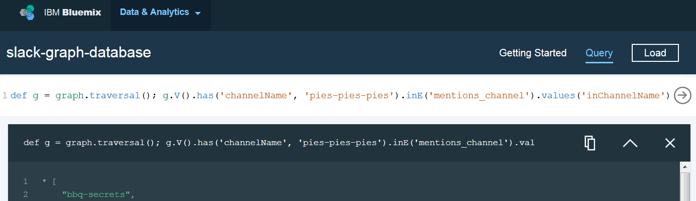

[ **< Analytics for Slack** Home](https://github.com/ibm-cds-labs/slack-analytics) 
# Load Slack Analytics into IBM Graph

Now that you've [collected Slack statistics](https://github.com/ibm-cds-labs/slack-analytics/tree/master/slack-stats), you can load your Slack data into an IBM Graph database and query it. 

##Prerequisites

 * If you haven't already, follow the Slack [statistics collection instructions](https://github.com/ibm-cds-labs/slack-analytics/tree/master/slack-stats) so you have data to load into IBM Graph.
 * Note the location of the two statistics files you generated: `<slack-team-name>-stats.json` and `<slack-team-name>-keyword-stats.json`. 
 * Note the location of `channels.json` and `users.json`. These two files are included in the extracted Slack message archive file.

##Prepare Graph 

###Install dependencies

 Install the module dependencies in the `slack-graph-database` directory

```
    $ pwd
    slack-analytics/
    $ cd slack-graph-database
    $ npm install
```

### Provision an IBM Graph service instance and bind it to Graph setup scripts

1. Create a new IBM Graph service instance in Bluemix named **slack-graph-database**

    ```
    $ cf create-service "IBM Graph" Entry slack-graph-database
    ```

2. Create service credentials for this service instance

    ```
    $ cf create-service-key slack-graph-database Credentials-1
    ```

3. Collect the service credentials 

    ```
    $ cf service-keys slack-graph-database
    name
    Credentials-1
  
    $ cf service-key slack-graph-database Credentials-1
    Getting key Credentials-1 for service instance slack-graph-database as some.user@some.company...
    {
      "apiURL": "your-IBM-Graph-instance-API-URL",
      "password": "your-IBM-Graph-instance-password",
      "username": "your-IBM-Graph-instance-username"
    }
    ```

4. Bind the service instance to the setup scripts in one of the following ways:

    * **Bind using a configuration file** 
        1. Locate file `vcap_services_template.json` in the `slack-graph-database` directory and rename it to `vcap_services.json`.
        2. Replace the dummy credentials with the credentials of your service instance:

            ```
            "..." : "...",
            "credentials": {
              "apiURL": "TODO-REPLACE-WITH-your-IBM-Graph-instance-API-URL",
              "username": "TODO-REPLACE-WITH-your-IBM-Graph-instance-username",
              "password": "TODO-REPLACE-WITH-your-IBM-Graph-instance-password"
            }
            ```

    * **Bind using an environment variable** 

        Define environment variable VCAP_SERVICES using the appropriate service credentials
      
         ```
            {"IBM Graph":[{"name":"slack-graph-database","label":"IBM Graph","plan":"Entry","credentials":{"apiURL":"TODO-REPLACE-WITH-your-IBM-Graph-instance-API-URL","username":"TODO-REPLACE-WITH-your-IBM-Graph-instance-username","password":"TODO-REPLACE-WITH-your-IBM-Graph-instance-password"}}]}
         ```

### Define the Slack schema in your Graph service

  Run the `define-slack-schema.js` script to define the Slack schema.

  ```
  $ node define-slack-schema.js -s schema/slack-graph-schema.json
  ```
  
### Generate the Slack graph model for your team

  Run `build-slack-graph-model.js` to generate a Slack graph model file using the statistic files that you [generated earlier](https://github.com/ibm-cds-labs/slack-analytics/tree/master/slack-stats).

  ```
  $ node build-slack-graph-model.js -s "</path/to/><slack-team-name>-stats.json" -k "</path/to/><slack-team-name>-keyword-stats.json" -c "</path/to/>channels.json" -u "</path/to/>users.json" -n <slack-model-name>
  ```

 > Example: 
 > ```node build-slack-graph-model.js -s "../stats/demo-team-stats.json" -k "../stats/demo-team-keyword-stats.json" -c "/home/wolli/demo-team Slack export May 3 2016/channels.json" -u "/home/wolli/demo-team Slack export May 3 2016/users.json" -n demo-team-0801```

You'll use the Slack graph model file you just generated (`<slack-model-name>.sgm`) in the next step to load the graph into the IBM Graph service instance.

### Load the Slack graph model into your IBM Graph service instance

  ```
  $ node load-slack-graph-model.js -m </path/to/><slack-model-name>.sgm
  ```

   > Example: 
 > ```node load-slack-graph-model.js -m demo-team-0801.sgm```

## Query the Slack graph 

Once the graph has been built you can query it. This is the basic model you created: 

 


Query the graph in any of these 3 ways:


- ### Use the Query Builder in Bluemix

   The Query Builder in the IBM Graph web console in Bluemix provides a simple interface to query the graph using the Gremlin query language. Results are returned in JSON.

   
   
   Try it out. Open Bluemix, go to your dashboard, click your **slack-graph-database** tile, and click the **Open** button. On the upper right of the screen, click **Query**.
  
- ### Sample applications

   Let users query the graph with the the Slack slash command, like my [**about** sample app](https://github.com/ibm-cds-labs/slack-analytics-about-service) does.
   
   
   
- ### Programmatic graph traversal
    
   Create your own application that uses the [REST API](https://ibm-graph-docs.ng.bluemix.net/api.html) or the (inofficial) [node.js library](https://github.com/ibm-cds-labs/nodejs-graph) to traverse the graph.


